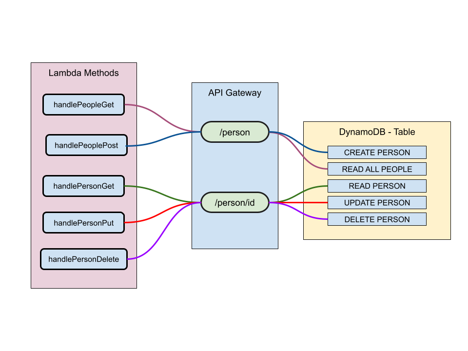

# Lab 18: Serverless API

## Author: Katharine Swilley

### Problem Domain

Create a single resource REST API using a domain model of your choosing, constructed using AWS Cloud Services.

### Features/Routes

- People Schema Key Pairs:
  - `{id: String,
    name: String,
    age: String,
    city: String}`
- `/people`
  - access POST method to create a new person
  - access GET method to get all people in the database
- `/people/id`
  - access GET, POST, DELETE methods for individual objects by their id

### Testing

Tested all methods within AWS API Gateway to verify functionality

### UML

